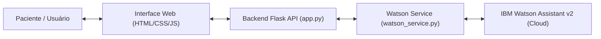

# FIAP - Projeto CardioIA

**Turma** 

2TIAOA-2026

**Instrutor**

Caique Nonato da Silva Bezerra

**Integrantes do grupo**
* Davi Santos Ferreira
* Lais Kurahashi
* Lucas Martinelli

---  

# Organização do projeto

* **config:** Centraliza arquivos de configuração, mapeamento de sintomas (.csv), dicionários de regras, diagramas, os pesos dos modelos CNN salvos (`.pth`) e a exportação do Watson Assistant (`watson_assistant_skill.json`).
* **docs:** Reservada para a base de conhecimento textual e documentação técnica, incluindo relatórios do ESP32, Node-RED e Watson Assistant.
* **scripts:** Contém os notebooks (.ipynb), script de treinamento CNN (`cardioia_treinamento_cnn.py`), protótipo Streamlit (`cardioia_prototype.py`), código C++ do ESP32 (`skecth_esp32.ino`), serviço do Watson (`watson_service.py`), backend Flask (`app.py`) e suíte de testes (`test_watson_api.py`).
* **templates / static:** Interface web moderna de interação com o assistente conversacional.
* **temp:** Diretório destinado a arquivos gerados durante a execução, logs de processamento e tabelas de testes temporárias.
* **assets:** Armazena os ativos do projeto, dados cardiologia (`heart.csv`), exames de ECG e imagens de dashboards.
* **requirements.txt:** Listagem de todas as bibliotecas Python necessárias para execução do ecossistema.
* **main.bat:** Script inicializador automatizado interativo para Windows com menu de opções para a Fase 4 e Fase 5.

---  

# 🏥 CardioIA – A Era da Cardiologia Inteligente

## 📖 Proposta de Projeto:

As doenças cardiovasculares são a principal causa de morte no mundo, com cerca de 17,9 milhões de óbitos anuais. O projeto CardioIA surge para revolucionar a cardiologia, criando uma plataforma digital interativa que simula um ecossistema hospitalar moderno. O objetivo é integrar ciência de dados e inteligência artificial para antecipar eventos críticos e personalizar o cuidado ao paciente.

## 📌 Objetivos do Projeto
* Impacto Social: Simular a prática hospitalar com dados reais.

* Soluções Tecnológicas: Desenvolver sistemas de triagem digital, diagnósticos assistidos por IA, monitoramento via IoT e assistentes virtuais (chatbots).

## 📂 Estrutura da Fase 1: Curadoria de Dados: 

Batimentos de Dados (Mapeando o Coração Moderno)Nesta fase inicial, o foco é a construção de uma base de dados sólida e a discussão sobre governança e ética em IA.

1. **Dados Numéricos (IoT):** Utilizaremos um conjunto de dados com variáveis clínicas para identificar perfis de risco.
    * Justificativa Técnica: Fatores como idade avançada, hipertensão e diabetes são os principais preditores de desfechos cardiovasculares negativos.
    * Aplicação em IA: Esses dados alimentarão classificadores supervisionados para identificar riscos de doenças na Fase 2.

2.  **Dados Textuais (NLP):** Exploração de artigos científicos e dados epidemiológicos do Brasil.
    * Texto 1: Estudo sobre a associação entre estilo de vida (tabagismo, dieta) e risco cardiovascular no Brasil.
    * Texto 2: Estudo de coorte de 10 anos sobre a frequência de eventos cardíacos em pacientes com condições inflamatórias crônicas (Artrite Reumatoide) usando dados do DATASUS.
    * Aplicação em NLP: O Processamento de Linguagem Natural permitirá a extração de sintomas e a criação de chatbots de orientação ao paciente na Fase 5.

3. **Dados Visuais (Visão Computacional):** Coleta de imagens de exames diagnósticos, como Eletrocardiogramas (ECG).
    * Justificativa Técnica: A análise visual automatizada é crucial para detectar arritmias e anomalias de forma precoce.
    * Aplicação em VC: Na Fase 4, treinaremos modelos de visão computacional para interpretar padrões e criar módulos de visualização diagnóstica.

Aqui está o conteúdo das novidades da Fase 2 estruturado em formato Markdown para você copiar e colar diretamente no seu arquivo README.md.

Markdown
## 🤖 Fase 2 – Inteligência e Diagnóstico Automatizado

Nesta etapa, o **CardioIA** avançou para o desenvolvimento de motores de decisão, transformando os dados brutos coletados na Fase 1 em diagnósticos assistidos por modelos de Machine Learning.

### Desenvolvimento das partes
* **Fontes de dados:**
    * Mapa de doenças: A listagem dos sintomas e doenças ficou por parte da Lais Kurahashi
    * Frases: A listagem das Frases ficou por parte do Lucas Martinelli
    * Base de treinamento de triagem: Base desenvolvida3 utilizando o Gemini.

1. **Diagnóstico por Ontologia e Machine Learning (Parte 1)**
Desenvolvemos um sistema capaz de interpretar relatos clínicos e sugerir possíveis patologias com base em um mapa de conhecimento médico estruturado.

* **Implementação:** Foram realizados testes entre os modelos de **Random Forest (Floresta Aleatória)** e **Árvore de Decisão (Decision Tree)** para processar as descrições dos pacientes e buscar a melhor correspondência no mapa de 100 doenças cadastradas.
* **Diferencial Técnico:** Implementamos técnicas de **NLP (Processamento de Linguagem Natural)**, como a limpeza de ruídos (remoção de acentos/pontuação) e o uso de *N-grams* no vetorizador TF-IDF.
    * **Resultado:** Isso permite que a IA identifique expressões complexas como "dor no peito" ou "falta de ar" em vez de apenas palavras isoladas, aumentando a precisão do diagnóstico sugerido.
* **Testes Realizados**
    * **Random Forest (Floresta Aleatória)**: O Random Forest Classifier apresentou um resultado bastante coeso com relação aos sintomas apresentados no mapa de 100 doenças, se tornando também a alterantiva mais facil de manipular e realizar os testes.
    * **Árvore de Decisão (Decision Tree):** Foram feitos alguns testes utilizando o modelo de Decision Tree, entretanto, para esse caso os resultados se apresentaram super confusos e irrealistas, mesmo realizando manipulação e normalização dos dados.

2. **Classificador de Triagem: Alto vs. Baixo Risco (Parte 2)**
Implementamos um classificador estatístico focado na priorização de atendimentos, simulando protocolos reais de triagem clínica.

* **Tecnologia:** Uso de **Vetorização TF-IDF** para transformar texto em dados numéricos e também modelos como o **Árvore de Decisão (Decision Tree)** e **Logistic Regression** para a lógica de classificação.
* **Governança de Dados:** Os modelos foram treinados para identificar gatilhos de emergência, garantindo que sintomas críticos sejam classificados como "Alto Risco", essencial para a responsabilidade ética no desenvolvimento de IAs para a saúde.

### 📹 Demonstração e Avaliação
* **Análise de Performance:** O modelo demonstrou eficácia na detecção de padrões de risco, embora a acurácia reflita a necessidade de bases de dados maiores para lidar com a subjetividade dos relatos humanos.
* **Vídeo de Demonstração:** [[Link Youtube Capitulo 2 CARDIO IA](https://youtu.be/xBCWgkPsdxc)]

---

## 🚀 Fase 3: Monitoramento em Tempo Real e Resiliência IoT

### Desenvolvimento das partes
* **Fontes de dados:**
    * ESP32: Lais Kurahashi
    * Conexão MQTT e configurações: Lucas Martinelli
    * Git Hub: Davi Ferreira
    * NODE-RED: Davi Ferreira

Nesta fase do projeto **CardioIA**, implementamos a integração completa entre a camada Edge e a nuvem (Cloud/Fog), garantindo que o monitoramento do paciente seja contínuo, mesmo em situações de falha de conectividade.

Observação: Os processos de sensores feitos nessa fase, foram relaizados com base em uma simulação do ESP32 na Wokwi

### 🛠️ O que foi implementado:
1. **Edge Computing (ESP32):**
   - Programação em C++ para leitura de Sensores de Temperatura (DHT22) e Frequência Cardíaca (Simulada via Potenciômetro).
   - **Lógica de Resiliência:** Implementação de um buffer local que armazena os sinais vitais caso o Wi-Fi caia, sincronizando-os automaticamente ao recuperar a conexão.
   - **Alerta Local:** Acionamento de LED físico para triagem imediata de anomalias (BPM > 120 ou Temp > 38°C).

2. **Cloud & Conectividade (MQTT):**
   - Configuração do protocolo MQTT via Broker HiveMQ para transmissão de dados em formato JSON.
   - Comunicação assíncrona entre o simulador Wokwi e o servidor local.

3. **Interface e Inteligência (Node-RED):**
   - Criação de um Dashboard interativo com gráficos de tendência e medidores instantâneos.
   - **Motor de Regras:** Nós de desvio condicional que disparam notificações visuais no painel ao detectar estados críticos de saúde.

### 📂 Estrutura de Arquivos desta Fase

Os arquivos referentes a esta etapa estão organizados nos seguintes diretórios:

* **Documentação:**
    * [`Relatorio_ESP32.pdf`](./docs/Relatorio_ESP32.pdf) - Detalhamento da arquitetura de borda e resiliência.
    * [`Relatorio_Node-RED.pdf`](./docs/Relatorio_Node-RED.pdf) - Explicação da camada de nuvem, MQTT e lógica de alertas.
* **Scripts e Configurações:**
    * [`skecth_esp32.ino`](./scripts/skecth_esp32.ino) - Código fonte C++ do microcontrolador.
    * [`ESP32_diagram.json`](./config/ESP32_diagram.json) - Diagrama de conexões do simulador.
* **Assets:**
    * Imagens e prints do funcionamento do Dashboard estão na pasta [`/assets`](./assets).

### 🌐 Simulação Online (Wokwi)

O protótipo funcional pode ser testado diretamente no navegador através do link abaixo:

🔗 **[Projeto CardioIA no Wokwi](https://wokwi.com/projects/463793755500080129)**

---

## 🧠 Fase 4: Inteligência e Visão Computacional (CNNs)

Nesta fase, expandimos o motor de diagnósticos lógicos do CardioIA para classificar imagens de Eletrocardiograma (ECG), diferenciando exames normais (Classe N) de anomalias (Classe M).

### Desenvolvimento e Modelagem
Desenvolvemos e avaliamos duas abordagens de Redes Neurais Convolucionais usando o framework **PyTorch** para processar exames de ECG redimensionados para `224x224` pixels:

#### 1. CNN do Zero (Scratch CNN)
Trata-se de uma rede neural convolucional profunda e otimizada, desenvolvida do absoluto zero:
*   **Camada de Entrada:** Imagem em escala RGB de dimensões `3 x 224 x 224`.
*   **Extrator de Features (Blocos Convolucionais):**
    *   **Bloco 1:** `Conv2D(3 -> 16 canais, kernel=3, padding=1)` + `ReLU` + `MaxPool2d(kernel=2, stride=2)` $\rightarrow$ Reduz a dimensão para `16 x 112 x 112`.
    *   **Bloco 2:** `Conv2D(16 -> 32 canais, kernel=3, padding=1)` + `ReLU` + `MaxPool2d(kernel=2, stride=2)` $\rightarrow$ Reduz a dimensão para `32 x 56 x 56`.
    *   **Bloco 3:** `Conv2D(32 -> 64 canais, kernel=3, padding=1)` + `ReLU` + `MaxPool2d(kernel=2, stride=2)` $\rightarrow$ Reduz a dimensão para `64 x 28 x 28`.
*   **Camada Classificadora (Fully Connected):**
    *   `Flatten` para vetorizar as saídas das convoluções em um array unidimensional de `50.176` neurônios.
    *   `Linear(50176 -> 128 neurônios)` + `ReLU` + `Dropout(p=0.5)` para prevenir o sobreajuste (overfitting).
    *   `Linear(128 -> 2 neurônios de saída)` mapeando para as classes finalistas (Normal e Anomalia).

#### 2. Transfer Learning (ResNet50)
Um modelo avançado baseado em aprendizado por transferência de conhecimento:
*   **Base:** Arquitetura `ResNet50` carregada com pesos pré-treinados da base ImageNet.
*   **Congelamento (Freezing):** Todos os pesos originais do extrator de features da ResNet50 foram congelados (`requires_grad = False`). Isso nos permite reaproveitar filtros visuais robustos de bordas e texturas já consolidados.
*   **Cabeça de Classificação:** A camada de saída original (`fc`) foi substituída por uma nova camada linear adaptada para nosso cenário: `nn.Linear(2048 -> 2 neurônios de saída)`. Apenas esta camada foi deixada livre para o aprendizado dos gradientes.

### Resultados e Métricas de Teste
Os modelos foram validados no conjunto de teste independente contendo 115 exames de ECG e alcançaram classificação perfeita:

| Métrica | CNN do Zero | ResNet50 Transfer Learning |
| :--- | :---: | :---: |
| **Acurácia** | 1.0000 | 1.0000 |
| **Precisão** | 1.0000 | 1.0000 |
| **Recall (Sensibilidade)** | 1.0000 | 1.0000 |
| **F1-Score** | 1.0000 | 1.0000 |

*As matrizes de confusão e o gráfico do histórico de perdas/acurácia estão salvos na pasta `/assets`.*

### Protótipo de Apresentação Interativa (Streamlit)

Criamos uma aplicação web local de demonstração em poucas linhas de código usando o framework **Streamlit** para fins de homologação e apresentação do sistema hospitalar:
*   **Seletor de Modelos:** Permite alternar dinamicamente na barra lateral do painel entre os pesos do modelo *CNN do Zero* (`~25MB`) e do *ResNet50 Transfer Learning* (`~94MB`).
*   **Seleção de Imagens de Teste:** Varre o diretório de testes e exibe os exames disponíveis para a escolha do médico/usuário.
*   **Visualização e Inferência:** Exibe o exame selecionado na tela e, ao clicar em **"Analisar Exame"**, exibe o laudo estilizado contendo a predição da IA (**Padrão Identificado: Normal** em verde ou **Padrão Identificado: Anomalia Detectada** em vermelho) acompanhado do percentual exato de certeza.

### Como Executar o Aplicativo
1.  **Inicialização Rápida (Recomendado):**
    Execute o arquivo `main.bat` na raiz do projeto. Ele se encarregará de ler o `requirements.txt`, instalar todas as bibliotecas necessárias automaticamente e iniciar a interface Streamlit.
    ```powershell
    .\main.bat
    ```
2.  **Execução Manual:**
    ```powershell
    pip install -r requirements.txt
    streamlit run scripts/cardioia_prototype.py
    ```
    O aplicativo abrirá no seu navegador padrão em `http://localhost:8501`.


---

## 💬 Fase 5: Assistente Cardiológico Conversacional (IBM Watson Assistant & Flask API)

Na Fase 5, o ecossistema **CardioIA** avança para o desenvolvimento de um **Assistente Cardiológico Conversacional (Chatbot)**, capaz de orientar pacientes, interpretar relatos clínicos em linguagem natural, esclarecer dúvidas de exames e simular protocolos reais de triagem hospitalar.

### 👥 Divisão de Atividades
* **Lais Kurahashi:** Modelagem Conversacional no IBM Watson Assistant (Intenções, Entidades e Árvore de Decisão), exportação JSON da Skill e Relatório Técnico e Conceitual de Saúde.
* **Davi Ferreira:** Desenvolvimento do Backend em Python (Flask), integração com a API v2 do Watson Assistant, construção e integração da interface web conversacional, gerenciamento de sessões, governança técnica do repositório, bateria de testes automatizados e roteiro de validação.

---

### 🏗️ Arquitetura da Solução Conversacional



1. **Camada de Inteligência e NLP (IBM Watson Assistant):**
   * **12 Intenções (`#intents`):** `#saudacao`, `#relatar_sintoma`, `#preparo_exame`, `#agendamento`, `#consultar_resultado`, `#entender_resultado`, `#prazo_entrega`, `#informar_pressao`, `#informar_frequencia`, `#pedir_orientacao`, `#falar_com_atendente`, `#despedida`.
   * **6 Entidades (`@entities`):** `@tipo_exame` (*ecocardiograma, holter, mapa, eletrocardiograma, teste ergometrico*), `@sintomas` (*dor_peito, falta_de_ar, palpitacao, etc.*), `@duvida_resultado`, `@tipo_orientacao`, `@sys-date`, `@sys-time`.
   * **61 Nós de Diálogo:** Árvore de decisão com desambiguação clínica, confirmação dinâmica de agendamentos e transbordo para atendente humano.
   * **Governança e Ética:** O assistente não realiza diagnósticos médicos definitivos, focando em acolhimento empático, triagem preventiva e orientação segura.

2. **Camada de Integração Backend (Python + Flask):**
   * Módulo desacoplado `WatsonAssistantService` em [`scripts/watson_service.py`](./scripts/watson_service.py).
   * Servidor Flask REST em [`scripts/app.py`](./scripts/app.py) com CORS habilitado e gerenciamento de sessões e reconexão automática.
   * Arquivo de configuração de credenciais via variáveis de ambiente (`.env`).

3. **Interface de Interação com o Usuário:**
   * Aplicação web responsiva estilizada em [`templates/index.html`](./templates/index.html), com chat em tempo real, indicador de digitação (*typing indicator*), botões de sugestão rápida (*chips*) e alerta ético de uso.

---

### 🔌 Documentação da API REST

| Método | Endpoint | Descrição | Exemplo de Payload |
| :--- | :--- | :--- | :--- |
| `GET` | `/api/status` | Health Check da API e status da conexão com Watson | N/A |
| `POST` | `/api/session` | Cria uma nova sessão no Watson Assistant v2 | N/A |
| `POST` | `/api/message` | Envia mensagem do paciente e recebe o laudo de resposta | `{"session_id": "...", "message": "Estou sentindo dor no peito"}` |
| `DELETE` | `/api/session/<id>` | Encerra e desaloca a sessão aberta no Watson | N/A |

---

### 🧪 Bateria de Testes Automatizados

O projeto inclui uma suíte automatizada de testes clínicos em [`scripts/test_watson_api.py`](./scripts/test_watson_api.py) cobrindo:
1. **Health Check da API** (Status 200 e Watson conectado).
2. **Ciclo de Vida de Sessão** (Criação e desalocação).
3. **Fluxo de Boas-Vindas** (`#saudacao`).
4. **Triagem Clínica Crítica** (`#relatar_sintoma` com `@sintomas:dor_peito`).
5. **Preparo de Exame** (`#preparo_exame` com `@tipo_exame:holter`).
6. **Agendamento Cardiológico** (`#agendamento` com `@tipo_exame:ecocardiograma`).
7. **Transbordo para Atendente Humano** (`#falar_com_atendente`).

Para executar a bateria de testes:
```powershell
python scripts/test_watson_api.py
```

---

### 🚀 Como Executar o CardioIA (Fase 5)

1. **Inicialização Automatizada (Recomendado):**
   Execute o script `main.bat` na raiz do projeto e selecione a opção `[1]` para iniciar o Chatbot ou `[3]` para rodar os testes:
   ```powershell
   .\main.bat
   ```
   Acesse a interface no navegador em: **`http://localhost:5000`**

2. **Execução Manual da API:**
   ```powershell
   pip install -r requirements.txt
   python scripts/app.py
   ```

---

### 📹 Roteiro Sugerido para Vídeo Demonstrativo (Até 5 Minutos)

* **0:00 - 1:00 (Abertura e Contexto):** Apresentação dos integrantes, turma e o objetivo da Fase 5 (criação do Assistente Cardiológico com Watson Assistant e Flask).
* **1:00 - 2:15 (Modelagem Watson):** Apresentação rápida da árvore de diálogo, intenções (#relatar_sintoma, #agendamento, #preparo_exame) e justificativa ética em saúde.
* **2:15 - 3:30 (Demonstração do Chatbot em Tempo Real):**
  * Mensagem inicial de acolhimento.
  * Teste do preparo do exame (ex.: "Preciso de jejum para o Holter?").
  * Teste de relato de sintoma crítico (ex.: "Sinto dor forte no peito e aperto").
  * Teste de solicitação de agendamento e transbordo para atendente humano.
* **3:30 - 4:30 (Arquitetura Backend & Testes):** Exibição da execução dos testes automatizados (`python scripts/test_watson_api.py`) no terminal, comprovando a integração via API REST.
* **4:30 - 5:00 (Conclusão e Próximos Passos):** Considerações finais sobre o ecossistema integrado CardioIA.
